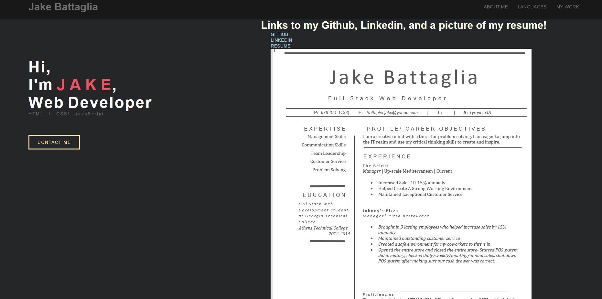
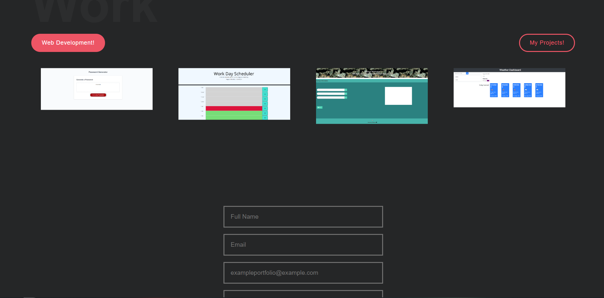

# HW7 Updated Portfolio

I created a CSS file that changes at 3 break points 
## Description

The page contains 3 pages that all link to one another through the Navbar.
The first page is an about me that has a picture and a short summary about me.
The second page integrates the use of task bars, that aren't functional yet, but they do show the languages/skills I have in coding.
The second page is a portfolio that has a few of the projects I've worked on recently.
The third page is a contact page that isn't interactive yet but will be in the future.

## Usage

Show off my projects and achievements to potential employers.

Give links to my GitHub, LinkedIn, and some other contact info.

## Pictures

## Links 
Deployed site: https://veigarmain.github.io/HW7/